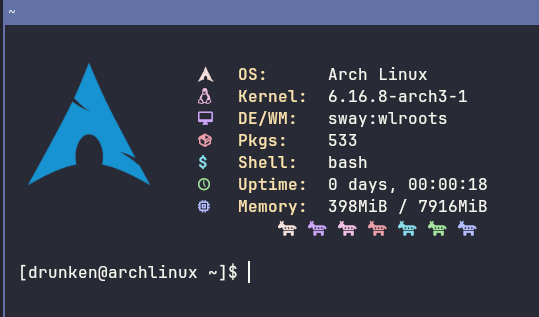

Nymph is a tiny, lightweight “fetch” utility written in Nim.

## Screenshot

   

## Features

- Kitty graphics protocol support: drop a PNG logo in the `logos/` directory (or `$NYMPH_LOGO_DIR`) and it will render in terminals that support the kitty graphical protocol.
- Self-scaling PNG rendering with configurable maximum width (default 200px) to keep the stats aligned.
- Built-in ASCII fallback logo, so output still looks good on terminals without Kitty graphics protocol support.
- Simple key=value config file (`~/.config/nymph/config.conf`) is generated on first run; tweak logo size, stats offset, or point to a custom logo path.
- Reasonable defaults: automatically selects a logo based on `/etc/os-release`, `$NYMPH_LOGO`, or falls back to the generic art.

## Usage

1. Install Nim/nimble.
2. Build and run:
   ```bash
   nimble release
   ```
   or 
   ```bash
   nim c -r src/nymph.nim
   ```
3. Optional CLI/env overrides:
   - `--logo foo` / `-logo foo` forces a specific logo name.
   - `--logo /full/path.png` loads a specific PNG directly.
   - `--no-color` / `--no-colors` disables ANSI colors in the stats output.
   - `NYMPH_LOGO=foo` or `NYMPH_LOGO_DIR=/path/to/logos` change selection/search paths.
4. Edit `~/.config/nymph/config.conf` to adjust:
   - `maxwidth` (pixels to reserve for the logo, default 200)
   - `statsoffset` (starting column for stats, default 22+auto padding)
   - `nocolor` (true/false to disable ANSI colors)
   - `customlogo` (full path to a PNG)

integrate it into shell startup scripts or keybindings as you like.

## Logos

- **PNG logos**: Place files named `<name>.png` inside any of the following (searched in order):
  1. Source `logos/` (shipped with the app)
  2. Project `logos/`
  3. `~/.config/nymph/logos` (auto-created on first run)
  4. `$NYMPH_LOGO_DIR`
  5. `<app_dir>/logos` and `<app_dir>/../share/nymph/logos`
  - You can also set a one-off `customlogo` path in `config.conf`.
- **Scaling**: PNG logos are self-scaling up to the configured maximum width.
- **Fallback**: If no PNG is found or Kitty graphics protocol aren’t available, Nymph displays the built-in ASCII “generic” logo.

## License

MIT — see `LICENSE`.
