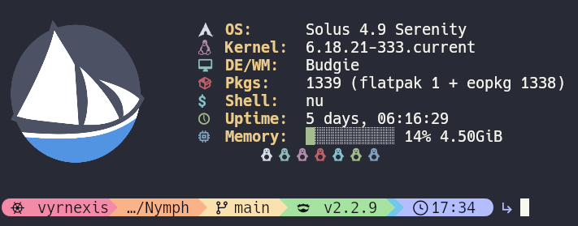

# Nymph

Nymph is a lightweight terminal system summary tool (fetch utility) written in Nim, with optional Kitty graphics logos, theming, and JSON output.

## Screenshot



## Why Nymph

- Fast startup and minimal dependencies
- PNG logos via Kitty graphics protocol (with ASCII fallback)
- Customizable output: themes, icon packs, layouts, and modules
- RAM usage level bar with percentage and numeric usage
- Script-friendly JSON mode
- Built-in diagnostics mode for setup troubleshooting

## Install / Build

### Prerequisites

- Nim `>= 2.0.0`
- Nimble

### Build release binary

```bash
nimble release
```

This creates `./bin/nymph`.

### Run directly from source

```bash
nim c -r src/nymph.nim
```

## Quick Start

Run with defaults:

```bash
./bin/nymph
```

Try a different look:

```bash
./bin/nymph --theme nord --icon-pack ascii --layout compact
```

Use only selected modules:

```bash
./bin/nymph --modules os,kernel,packages,memory
```

Output JSON for scripts/status bars:

```bash
./bin/nymph --json
```

Check diagnostics:

```bash
./bin/nymph --doctor
```

## CLI Reference

- `--logo <name|/full/path.png>`: use a logo by name or absolute/relative PNG path
- `--no-color` / `--no-colors`: disable ANSI colors
- `--json`: print machine-readable JSON and exit
- `--doctor`: print environment/config/logo diagnostics and exit
- `--theme <name>`: `catppuccin`, `nord`, `gruvbox`, `plain`
- `--icon-pack <name>`: `nerd`, `ascii`, `mono`
- `--layout <name>`: `full`, `compact`, `minimal`
- `--modules <csv>`: explicit module list (example: `os,kernel,packages,memory`)
- `--list-themes`: print supported themes
- `--list-icon-packs`: print supported icon packs
- `-h`, `--help`: show help

## Environment Variables

- `NYMPH_LOGO=<name>`: default logo name override
- `NYMPH_LOGO_DIR=/path/to/logos`: extra logo search directory
- `NYMPH_CONFIG=/path/to/config.conf`: custom config file path

## Configuration

On first run, Nymph creates:

- `~/.config/nymph/config.conf`
- `~/.config/nymph/logos/`

Supported `config.conf` keys:

- `maxwidth`: max logo width in pixels (default `200`)
- `statsoffset`: stats start column (default `22`, with auto padding)
- `nocolor`: `true` or `false`
- `customlogo`: full path to PNG logo file
- `theme`: `catppuccin|nord|gruvbox|plain`
- `iconpack`: `nerd|ascii|mono`
- `layout`: `full|compact|minimal`
- `modules`: comma-separated module list
- `json`: `true` or `false` (default output mode)

Example:

```conf
maxwidth = 220
statsoffset = 26
theme = nord
iconpack = nerd
layout = compact
modules = os,kernel,packages,memory,uptime
json = false
nocolor = false
customlogo = ""
```

## Modules

Available modules:

- `os`
- `kernel`
- `desktop`
- `packages`
- `shell`
- `uptime`
- `memory`
- `colours` (alias: `colors`)

Layout defaults:

- `full`: all modules + color row
- `compact`: `os,kernel,desktop,packages,memory,uptime`
- `minimal`: `os,kernel,packages,memory`

## Memory Bar

The `memory` module shows both numeric usage and a compact level bar:

```text
Memory:  ██░░░░░░░░ 16% 5.10GiB
```

The bar uses Nerd Font block glyphs with theme colors by default, and falls back to plain ASCII when `--no-color`, the `plain` theme, or a non-Nerd icon pack is active.

## Logos

Nymph searches for `<name>.png` in this order:

1. `src/logos/` (source tree)
2. `logos/` (project root)
3. `~/.config/nymph/logos/`
4. `$NYMPH_LOGO_DIR`
5. `<app_dir>/logos`
6. `<app_dir>/../share/nymph/logos`

Notes:

- `--logo <name>` selects a discovered logo name
- `--logo /path/logo.png` uses that file directly
- `customlogo` in config is used when CLI logo path is not provided
- If no PNG is found or Kitty graphics is unavailable, Nymph falls back to built-in ASCII art

## JSON Output Shape

`--json` returns keys such as:

- `os`, `kernel`, `desktop`, `shell`, `uptime`, `memory`
- `memory_info.known`, `memory_info.used_kib`, `memory_info.total_kib`, `memory_info.percent`
- `packages.total`
- `packages.sources` (per-manager counts)
- `theme`, `icon_pack`, `layout`, `modules`
- `no_color`, `kitty_graphics`
- `logo.name`, `logo.path`, `logo.width`, `logo.height`, `logo.ascii_fallback`

## Testing

Run smoke tests:

```bash
bash scripts/smoke.sh
```

This validates:

- baseline run
- color toggle
- logo overrides
- theme/icon/layout/modules options
- doctor mode
- JSON mode
- theme/icon-pack listings

## License

MIT. See [LICENSE](LICENSE).
